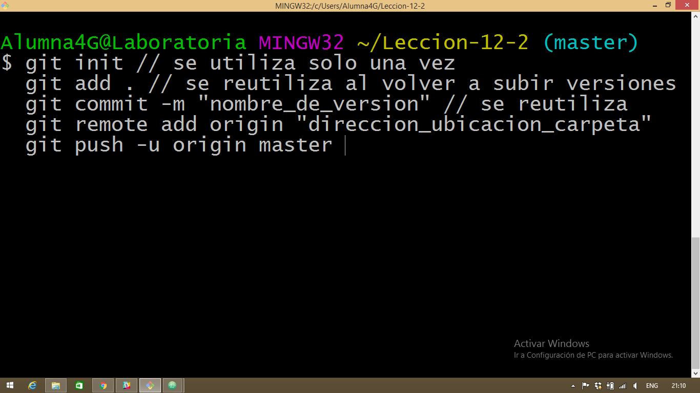

#  COMANDOS UTILIZADOS
### //con este comando configuramos la identidad ante git
### git config --global user.name "nombre_de_usuario" // para configurarlo con nombre de usuario
### git config --global user.email "tu_email@email.com" // para configurarlo con email

### git init
### git add .
### git commit -m "nombre de la version"
### git remote add origin "direccion_ubicacion_carpeta"//se reutiliza
### git push -u origin master //para subir el repositorio, se puede reutilizar
### git remote add origin DIRECCION_COMPLETA
### git push -u origin master

Format: 

### // para ver el status
### git status

### //para sacar un repositorio
### git clone liga_de_GitHub //la primera vez
### git pull origin master // las versiones que se vayan subiendo
